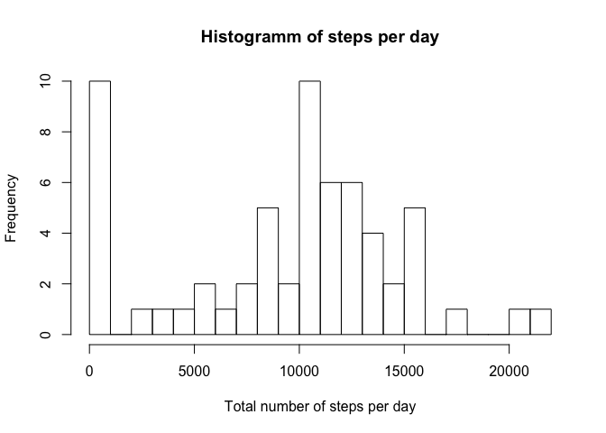

# Reproducible Research: Peer Assessment 1

First peer reviewed assignment for Coursera course "Reproducible Resaerch"

## Loading and preprocessing the data


```r
act <- read.csv("activity.csv", stringsAsFactors = FALSE)
# reformat date
library(lubridate)
act$date <- ymd(act$date)
```

## What is the total number of steps taken per day?

```r
library(dplyr)
```

```
## 
## Attaching package: 'dplyr'
## 
## The following objects are masked from 'package:lubridate':
## 
##     intersect, setdiff, union
## 
## The following objects are masked from 'package:stats':
## 
##     filter, lag
## 
## The following objects are masked from 'package:base':
## 
##     intersect, setdiff, setequal, union
```

Calculate the total number of steps per day and plot histogramm of steps per day:

```r
summary <- act %>% group_by(date) %>% summarise(sum = sum(steps, na.rm = TRUE))
hist(summary$sum, breaks = 20, xlab = "Total number of steps per day", main = "Histogramm of steps per day")
```

 

Calculate mean of the total number of steps taken per day:

```r
print(mean(summary$sum))
```

```
## [1] 9354.23
```

Calculate median of the total number of steps taken per day:

```r
print(median(summary$sum))
```

```
## [1] 10395
```

## What is the average daily activity pattern?
Make a time series plot:

```r
summary2 <- act %>% group_by(interval) %>% summarise(mean = mean(steps, na.rm = TRUE))
plot(summary2$interval, summary2$mean, type = "l", ylab = "mean number of steps", xlab = "interval", main = "daily activity")
```

 

Calculate the interval with the highest number of average steps:

```r
index <- which.max(summary2$mean)
print(index) # interval number
```

```
## [1] 104
```

```r
print(summary2$interval[index]) # corresponding interval
```

```
## [1] 835
```

```r
print(summary2$mean[index]) # corresponding step value
```

```
## [1] 206.1698
```


## Imputing missing values
Print number of missing values:

```r
sum(is.na(act$steps))
```

```
## [1] 2304
```

The NAs all occur as whole days:

```r
na <- is.na(act$steps)  # vector of NAs
na_days <- unique(act$date[na==TRUE])  # vector of dates that have NAs
act1 <- act[act$date %in% na_days,]  # subset of dataframe that includes only days that have NAs
summary(act1)
```

```
##      steps           date                        interval     
##  Min.   : NA    Min.   :2012-10-01 00:00:00   Min.   :   0.0  
##  1st Qu.: NA    1st Qu.:2012-10-26 00:00:00   1st Qu.: 588.8  
##  Median : NA    Median :2012-11-06 12:00:00   Median :1177.5  
##  Mean   :NaN    Mean   :2012-11-01 21:00:00   Mean   :1177.5  
##  3rd Qu.: NA    3rd Qu.:2012-11-11 00:00:00   3rd Qu.:1766.2  
##  Max.   : NA    Max.   :2012-11-30 00:00:00   Max.   :2355.0  
##  NA's   :2304
```
As can be seen, there are only NAs as values in act1.  
Therefore we will impute using the global mean of steps per 5 min intervall.  

```r
act2 <- act
act2$steps[is.na(act2$steps)] <- mean(act2$steps, na.rm = TRUE)
mean(act2$steps, na.rm = TRUE)
```

```
## [1] 37.3826
```

Redo the summary statistics above with the imputed dataset:

```r
summary3 <- act2 %>% group_by(date) %>% summarise(sum = sum(steps, na.rm = TRUE))
hist(summary3$sum, breaks = 20, xlab = "Total number of steps per day", main = "Histogramm of steps per day")
```

 

Calculate mean of the total number of steps taken per day

```r
print(mean(summary3$sum))
```

```
## [1] 10766.19
```

Calculate median of the total number of steps taken per day

```r
print(median(summary3$sum))
```

```
## [1] 10766.19
```
The imputed data leads to a larger mean and median. Also, median and mean are now the same. In the first dataset, they were different, which is always an indication that there is a large number of outliers, in this case, the outliers were caused by the NAs.

## Are there any differences in activity pattern between weekdays and weekends?  
Create daytype variable:

```r
find_daytype <- function(day) {
        weekends <- c("Saturday", "Sunday")
        if (day %in% weekends) {
                "weekend"
        } else {
                "weekday"
        }
}

act2$day <- weekdays(act2$date)
act2$daytype <- sapply(act2$day, find_daytype)
```


```r
# summarize data with dplyr
summary4 <- act2 %>% group_by(daytype, interval) %>% summarise(avg_steps = mean(steps))
```


```r
plot(summary4$interval[summary4$daytype=="weekday"], summary4$avg_steps[summary4$daytype=="weekday"], type = "l", ylab = "number of steps", xlab = "interval", main = "weekday")
```

 


```r
plot(summary4$interval[summary4$daytype=="weekend"], summary4$avg_steps[summary4$daytype=="weekend"], type = "l", ylab = "number of steps", xlab = "interval", main = "weekend")
```

 
